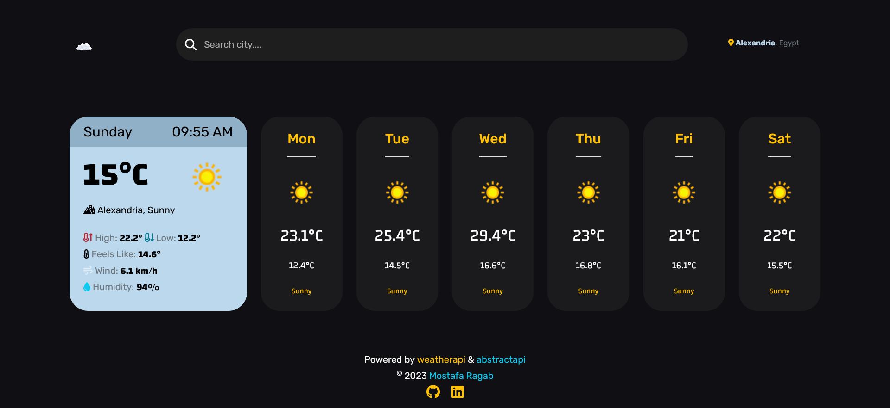

# JavaScript Weather App (route-assignment-11)

This is my work assigned by [Route-Academy](https://www.linkedin.com/company/routeacademy/mycompany/) during learning front-end web development.

## Quick notice ⚠️

You may notice that the app currently only displays the weather forecast for three days, with no information for the remaining days of the week. This is because the API we used for the weather data has a free trial period that has ended, limiting us to only a 3-day forecast on the free plan. Rest assured, we are working on a fix for this issue and will update the app as soon as possible to provide a full week's forecast.

## Table of contents

- [Screenshot](#screenshot)
- [Links](#links)
- [Built with](#built-with)
- [Features](#features)
- [Design Inspiration](#design-inspiration)
- [Author](#author)

### Screenshot

### Links

- Solution URL: [Code](https://github.com/IMostafaR/JavaScript-Weather-App)
- Live Site URL: [Live Site](https://imostafar.github.io/JavaScript-Weather-App/)

### Built with

- HTML5
- CSS3
- Bootstrap5
- JavaScript
- AJAX

### Features

- Real-Time location-based weather data via the user's IP address.
- All week weather forecast.
- The ability to search for any city and display its weather.

### Design Inspiration

- The UI design inspired by: [Ledo](https://dribbble.com/shots/19113627-Weather-Dashboard)

## Author

- GitHub - [IMostafaR](https://github.com/IMostafaR)
- Linkedin - [@imostafarh](https://www.linkedin.com/in/imostafarh/)
